# ON+ Shopping — React Native Ecommerce

**A feature-first React Native recreation of the complete Ecommerce flow from `on-tv-android`.**

ON+ Shopping implements the commerce experience as a standalone Expo application. Catalog data,
addresses and orders are deterministic local fixtures, while the screens preserve the original
Android cart rules, checkout flow and order lifecycle.

- **TanStack Query** owns server-like catalog state and native focus/network integration.
- **Zustand** owns persisted cart, checkout, address, order and language state.
- **i18next** localizes the complete UI and dummy commerce data in Vietnamese, English and
  Simplified Chinese.
- **Pure domain functions** keep stock, selection and cart-total rules independent from the UI.

> Every screen below was captured in English from a Pixel Android emulator at 1080 × 2424 and
> stored as an optimized 420 px WebP under [`docs/images`](docs/images). See
> [**How to update these images**](updateReadme.md) before replacing them.

---

## What this is built with

|                         |                                                                                 |
| ----------------------- | ------------------------------------------------------------------------------- |
| **Application**         | Expo SDK 57 · React Native 0.86 · React 19 · TypeScript 6                       |
| **Navigation**          | React Navigation native stack                                                   |
| **Remote-style state**  | TanStack Query with native online/focus integration                             |
| **Transactional state** | Zustand with AsyncStorage persistence                                           |
| **Localization**        | i18next · react-i18next · Expo Localization                                     |
| **UI**                  | Expo Image · Linear Gradient · Vector Icons · Safe Area Context                 |
| **Quality**             | Jest · jest-expo · React Native Testing Library · ESLint · Prettier             |
| **Data**                | Deterministic dummy repositories and bundled product artwork; no backend needed |

## Contents

|                                                      |                                                   |
| ---------------------------------------------------- | ------------------------------------------------- |
| [1. Home and catalog](#1-home-and-catalog)           | Discovery, campaigns and category filtering       |
| [2. Product discovery](#2-product-discovery)         | Detail, preview and localized product information |
| [3. Variants and cart](#3-variants-and-cart)         | Stock boundaries and seller-group selection       |
| [4. Checkout and payment](#4-checkout-and-payment)   | Totals, shipping and payment choice               |
| [5. Shipping addresses](#5-shipping-addresses)       | Address book, validation and area selection       |
| [6. Orders](#6-orders)                               | Status tabs, order cards and full details         |
| [7. Result and language](#7-result-and-language)     | Payment result and persisted locale switching     |
| [8. Architecture](#8-architecture)                   | Feature-first ownership and data flow             |
| [9. Cart parity and tests](#9-cart-parity-and-tests) | Android behavior preserved by unit tests          |
| [10. Run and verify](#10-run-and-verify)             | Local development and quality commands            |

---

## 1. Home and catalog

The Home screen combines campaign artwork, localized category shortcuts, promotion cards and two
product presentations. Category filtering keeps the original fixture value internally while the
route title and every visible product field follow the active language.

<table>
<tr><th width="50%">Commerce home</th><th width="50%">Filtered catalog</th></tr>
<tr>
<td>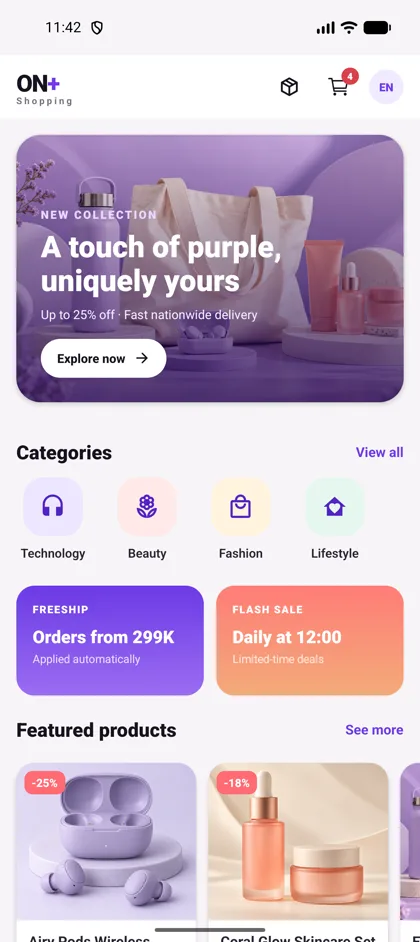</td>
<td></td>
</tr>
<tr><td colspan="2"><em>The header exposes Orders, Cart and Language Settings. The cart badge is derived from persisted Zustand state, while catalog content is loaded through TanStack Query from the dummy repository.</em></td></tr>
</table>

## 2. Product discovery

Product detail localizes the name, description, origin, warranty and sales metadata without
duplicating the source fixtures. Tapping the hero image opens a dedicated edge-to-edge preview.

<table>
<tr><th width="50%">Product detail</th><th width="50%">Full-screen preview</th></tr>
<tr>
<td>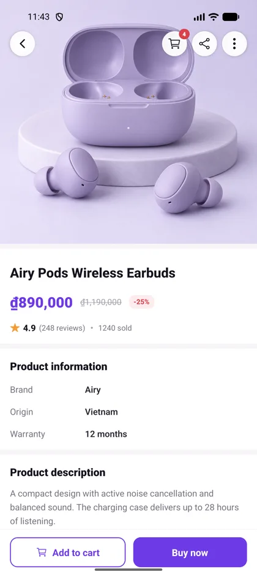</td>
<td></td>
</tr>
<tr><td colspan="2"><em>The fixed action bar keeps Add to cart and Buy now available while the information sections scroll independently. Preview uses the same bundled product asset, so it works offline.</em></td></tr>
</table>

## 3. Variants and cart

The variant sheet applies the selected variant's own stock limit and quantity boundary before an
item can enter the cart. Cart rows are grouped by seller and keep invalid states visible instead of
silently removing them.

<table>
<tr><th width="50%">Variant and quantity selector</th><th width="50%">Seller-grouped cart</th></tr>
<tr>
<td>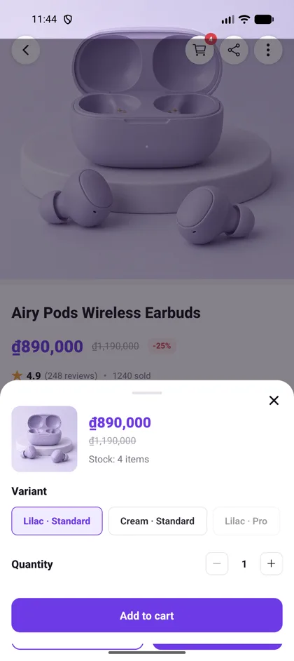</td>
<td>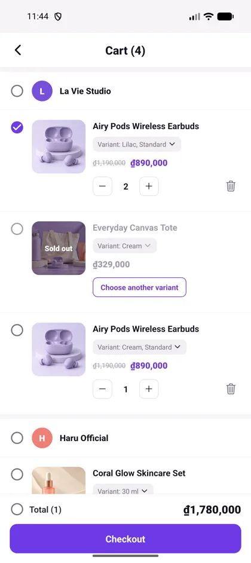</td>
</tr>
<tr><td colspan="2"><em>Sold-out and unavailable variants cannot be selected. Selection, select-all, stock overflow, quantity changes, replacement and totals all pass through the same pure cart domain rules used by the test suite.</em></td></tr>
</table>

## 4. Checkout and payment

Checkout reads only valid selected cart lines, groups them by seller and calculates merchandise,
shipping and promotion totals before creating an order. Payment choice is isolated in its own
screen and returned through typed navigation params.

<table>
<tr><th width="50%">Checkout summary</th><th width="50%">Payment method</th></tr>
<tr>
<td>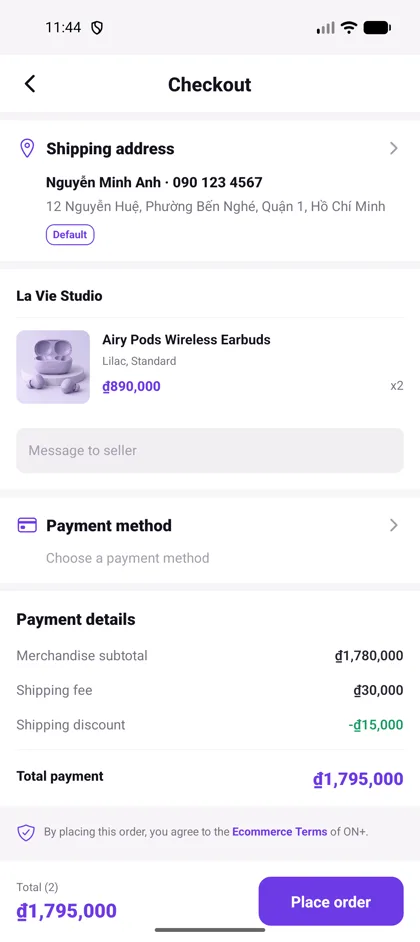</td>
<td>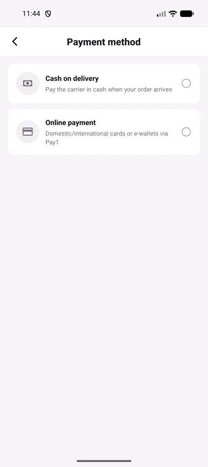</td>
</tr>
<tr><td colspan="2"><em>Checkout includes the default shipping address, seller note, selected variants, shipping discount, terms notice and final payment total. COD and Pay1 are modeled as explicit payment-method values.</em></td></tr>
</table>

## 5. Shipping addresses

The address feature owns its data, validation, persisted store and three-level administrative-area
selection. Checkout opens the same address book in selection mode instead of maintaining a second
copy of address state.

<table>
<tr><th width="50%">Address book</th><th width="50%">Validated address form</th></tr>
<tr>
<td>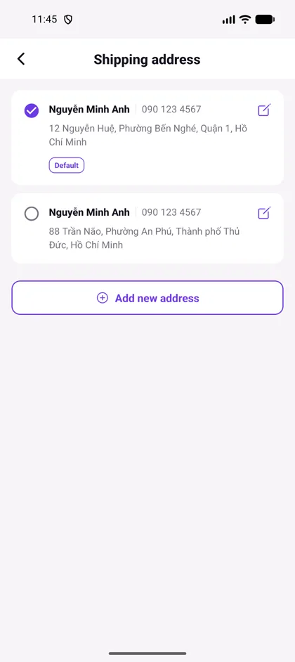</td>
<td>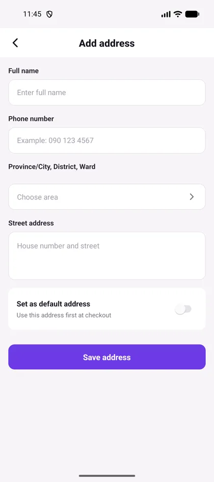</td>
</tr>
<tr><td colspan="2"><em>Users can add, edit, delete and select a default address. Name, Vietnamese phone number, area and street fields are validated in the feature domain before persistence.</em></td></tr>
</table>

<table>
<tr><th>Province, district and ward picker</th></tr>
<tr><td align="center">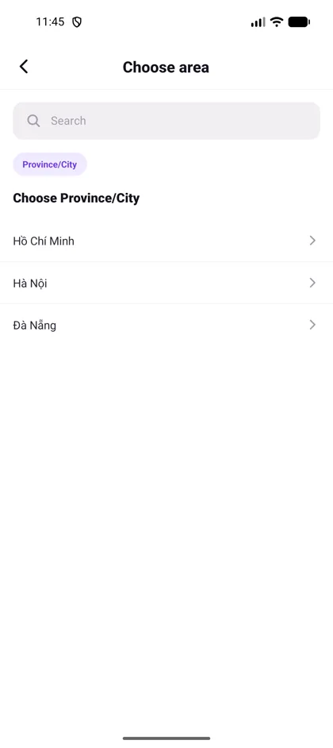</td></tr>
<tr><td><em>The picker progressively moves from Province/City to District and Ward. Changing a parent clears its dependent selections, preventing an impossible address combination.</em></td></tr>
</table>

## 6. Orders

Six horizontally scrollable tabs represent the original order lifecycle: To pay, To confirm, To
ship, Delivering, Delivered and Cancelled. Available actions are derived from status rather than
hard-coded into the card component.

<table>
<tr><th width="50%">Status-filtered orders</th><th width="50%">Order detail</th></tr>
<tr>
<td>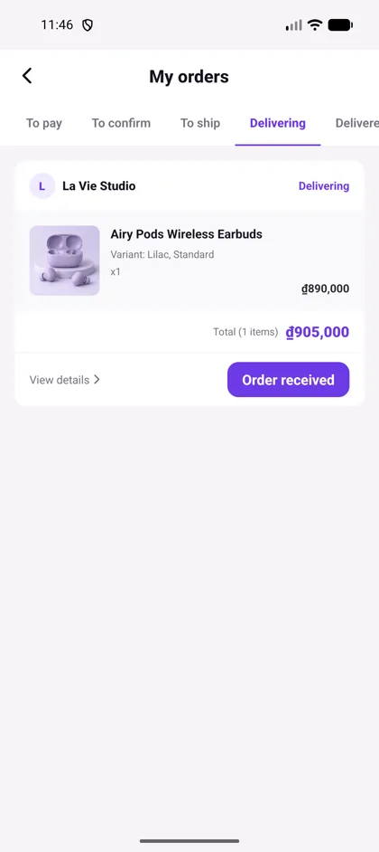</td>
<td>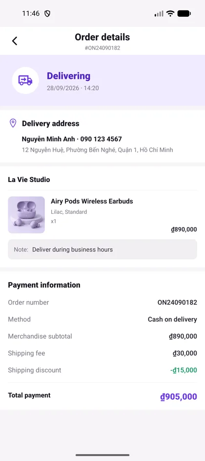</td>
</tr>
<tr><td colspan="2"><em>The order card exposes only the action valid for its status. Detail localizes fixture product names, variant labels, notes, cancellation reasons and payment labels while retaining stable order identifiers.</em></td></tr>
</table>

## 7. Result and language

A successful checkout clears only the purchased cart lines and creates a persisted order record.
Language selection applies immediately across navigation, currency formatting and dummy data, then
survives the next launch through AsyncStorage.

<table>
<tr><th width="50%">Order result</th><th width="50%">Language settings</th></tr>
<tr>
<td>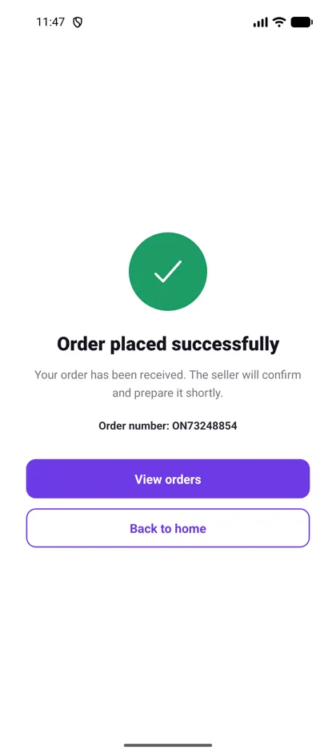</td>
<td>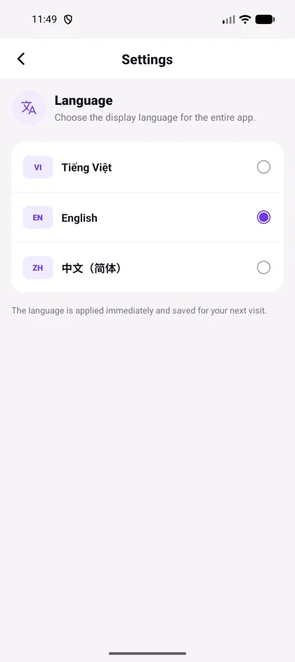</td>
</tr>
<tr><td colspan="2"><em>The first launch follows a supported device locale and falls back to Vietnamese. Users can switch between Vietnamese, English and Simplified Chinese at any time without restarting the app.</em></td></tr>
</table>

## 8. Architecture

The project follows feature-first boundaries: a feature owns its screens, components, domain
rules, repository fixtures, hooks and store. Shared code contains only reusable presentation and
platform concerns.

```text
src/
├── app/                    # providers, QueryClient and typed root navigation
├── features/
│   ├── address/            # data/domain/screens/store
│   ├── cart/               # components/data/domain/hooks/screens/store
│   ├── catalog/            # components/data/domain/hooks/screens
│   ├── checkout/           # screens/store
│   ├── orders/             # components/data/domain/screens/store
│   └── settings/           # language screen and persisted locale store
└── shared/                 # design system, i18n, primitives and utilities
```

```text
screens + components
        │
        ├── TanStack Query ── catalog repository ── deterministic fixtures
        │
        ├── Zustand stores ── cart / checkout / address / orders / locale
        │                          │
        │                          └── AsyncStorage persistence
        │
        └── pure domain rules ── stock / selection / totals / validation
```

No screen reimplements a cart invariant. UI events call the cart store, and the store delegates to
the same pure functions that the focused unit tests exercise.

## 9. Cart parity and tests

The cart behavior is ported from `OrderCartViewModel.kt`, `CardItem.kt` and `CardViewHolder.kt`:

- `quantity > stock` is overflow; `quantity === stock` remains valid.
- Overflow, sold-out, unlisted and unavailable variants cannot be selected.
- Select-all and seller selection select valid products only.
- Increasing quantity is capped at current stock.
- Decreasing quantity from one opens delete confirmation instead of reaching zero.
- Removing the last item removes its seller group.
- Removing the only unselected item reselects the remaining valid group state.
- Total includes selected product price × quantity only.
- Variant replacement resets selection and applies the new variant's stock boundary.

The current suite contains **54 unit tests** across six suites. Cart domain coverage is **100% of
lines** and **94.44% of branches**. Localization tests also enforce translation-key parity across
all three locales and verify translated dummy product and variant data.

## 10. Run and verify

```bash
npm install
npm run android
```

Quality checks:

```bash
npm run format:check
npm run lint
npm run typecheck
npm test -- --runInBand
npx expo export --platform android
```

The app needs no backend or environment variables. Catalog requests intentionally pass through an
async dummy repository so replacing fixtures with a real service does not change screen ownership.

## Demo video

[Watch the Android emulator walkthrough](artifacts/on-plus-shopping-demo.mp4).
