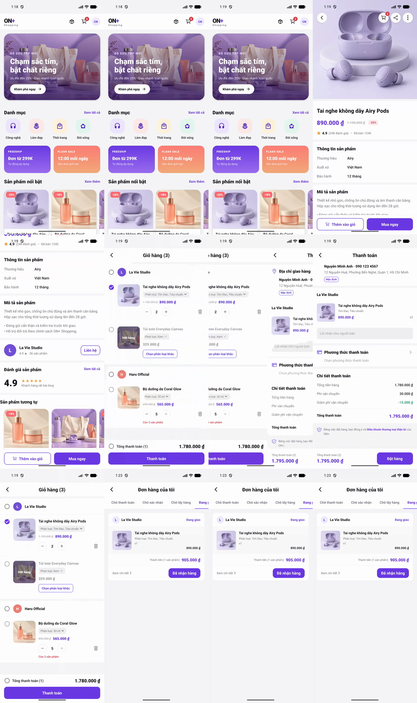

# ON+ Shopping — React Native Ecommerce

A professional React Native/Expo recreation of the Ecommerce flow in `on-tv-android`. The app uses local dummy repositories and bundled assets, so the complete shopping flow works without a backend.

## Demo

[Watch the Android emulator walkthrough](artifacts/on-plus-shopping-demo.mp4)



## Included flows

- Commerce home, campaign landing pages and category/product grids
- Product detail, full-screen preview, variant/quantity selection and related products
- Cart grouped by seller with profile/product selection, stock overflow, sold-out variants, variant replacement, quantity boundaries and delete confirmation
- Checkout with grouped products, shipping promotion, seller notes and preorder personal advice
- Shipping address book, validated add/edit/delete and three-level area selection
- COD/Pay1 payment selection, payment result and cart cleanup
- Six order-status tabs, order actions and full order detail/cancellation information
- Persisted cart, address book and order history

## Architecture

```text
src/
├── app/                    # providers, QueryClient and root navigation
├── features/
│   ├── address/            # data/domain/screens/store
│   ├── cart/               # components/data/domain/hooks/screens/store
│   ├── catalog/            # components/data/domain/hooks/screens
│   ├── checkout/           # screens/store
│   └── orders/             # components/data/domain/screens/store
└── shared/                 # design system, primitives and utilities
```

The project follows feature-first boundaries. TanStack Query owns server-like async catalog state; Zustand owns local transactional state. Cart invariants live in pure domain functions so UI, persistence and tests use the same source of truth.

## Android cart parity

The cart behavior is ported from `OrderCartViewModel.kt`, `CardItem.kt` and `CardViewHolder.kt`:

- `quantity > stock` is overflow; `quantity === stock` remains valid.
- Overflow, sold-out, unlisted and unavailable variants cannot be selected.
- Select-all/profile selection only selects valid products.
- Increasing quantity is capped at current stock.
- Decreasing quantity from one opens delete confirmation rather than reaching zero.
- Removing the last item removes its seller group; removing the only unselected item reselects the group.
- Total only includes selected product price × quantity.
- Variant replacement resets selection and applies its own stock boundary.

## Stack

- Expo SDK 57, React Native 0.86 and TypeScript 6
- React Navigation native stack
- Zustand with AsyncStorage persistence
- TanStack Query with native online/focus integration
- Jest + jest-expo + React Native Testing Library
- ESLint flat config and Prettier

## Run

```bash
npm install
npm run android
```

Other checks:

```bash
npm run typecheck
npm run lint
npm test -- --runInBand
npx expo export --platform android
```

## Tests

The current suite contains 49 unit tests. Most are focused on the cart domain and Zustand integration, including overflow quantities, stock boundaries, invalid variants, group/item selection, totals, removal confirmation, profile cleanup, add-to-existing behavior and variant replacement.
